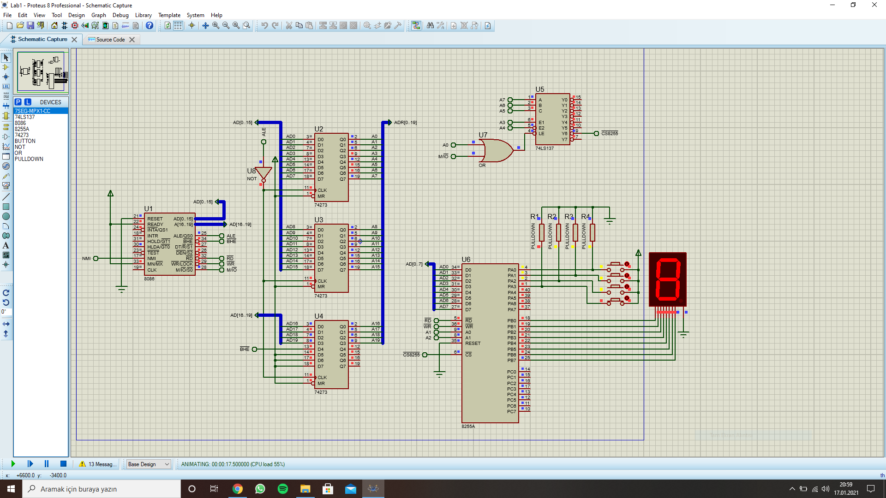
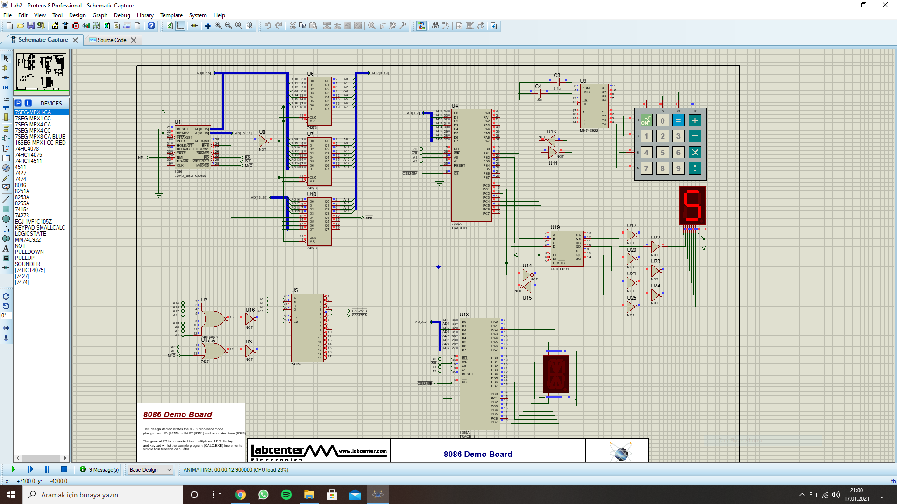
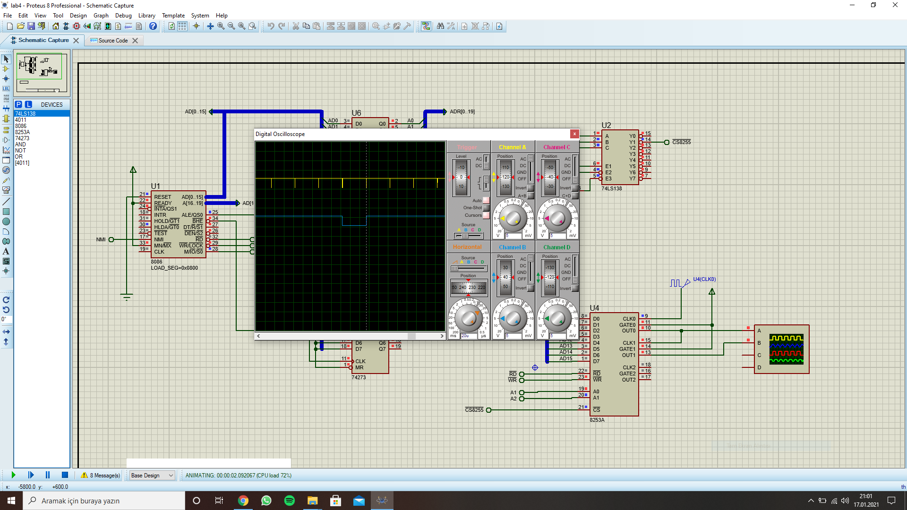
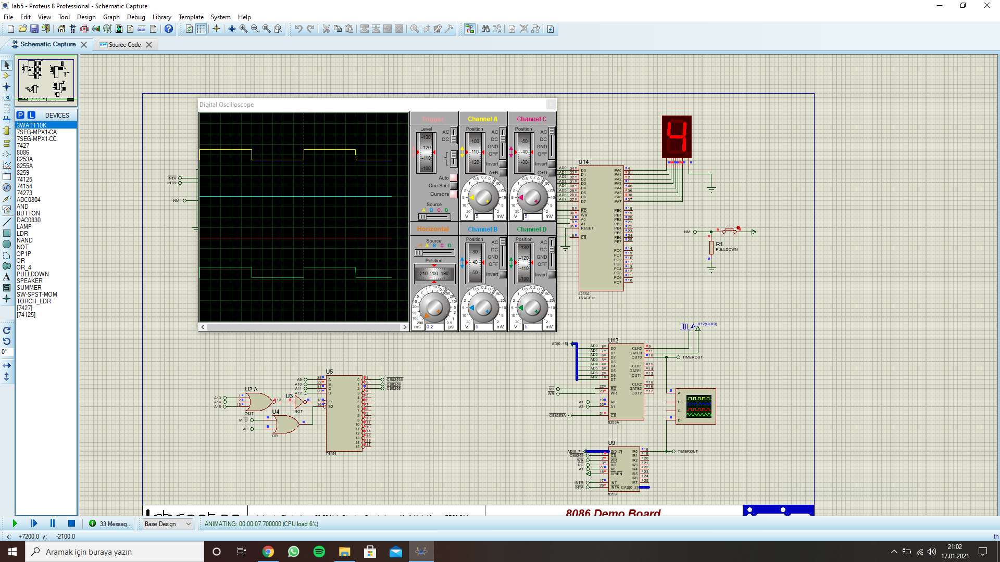

#Mikroişlemci Sistemleri
Mikroişlemci Sistemleri dersinin lab soruları ve cevapları bulunmaktadır. İşe yaraması dileğiyle :)

1. Lab
	7 Segment kullanımı.
2. Lab
	Yalnızca çarpma işlemi yapan hesap makinesi.
3. Lab
	PIC' de bulunan TOPSECRET verisini aynı baud rate' de seri haberleşme ile okuma.
4. Lab
	Saniyede 20 pulse işareti üreten 8254 kullanımı.
5. Lab
	8254 ve 8259 ile 8086' da interrupt kullanımı.

## Ekran Görüntüleri

Lab1
:------------------------------:

Lab2
:------------------------------:

Lab3
:------------------------------:

Lab4
:------------------------------:

Lab5
:------------------------------:
